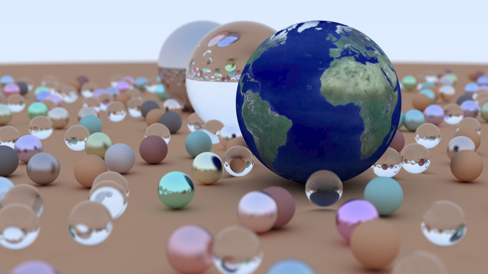
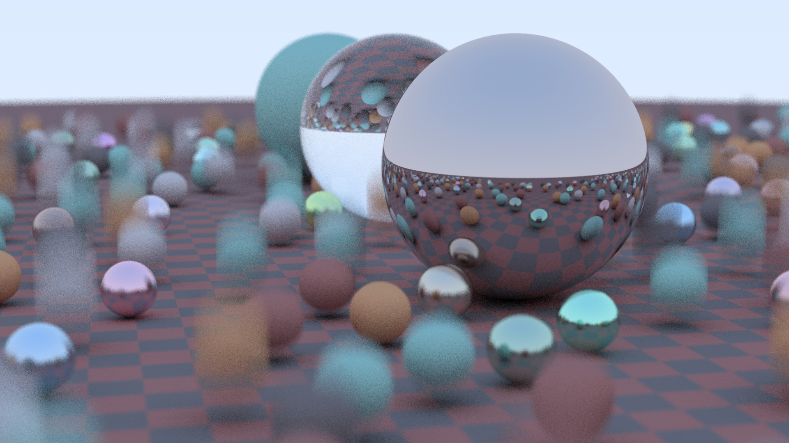
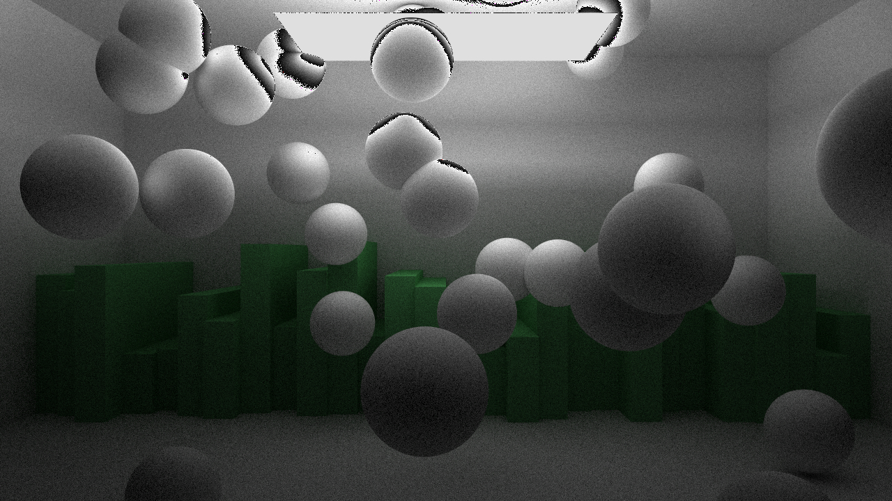

# J-Ray

This is a multithreaded path tracer built in my spare time.

It is built off of Peter Shirley's [Ray Tracing in One Weekend](https://raytracing.github.io/) book series and the [Physically Based Rendering](http://www.pbr-book.org/) book.

While I'm still adding features to it, here are some images made with the project.

